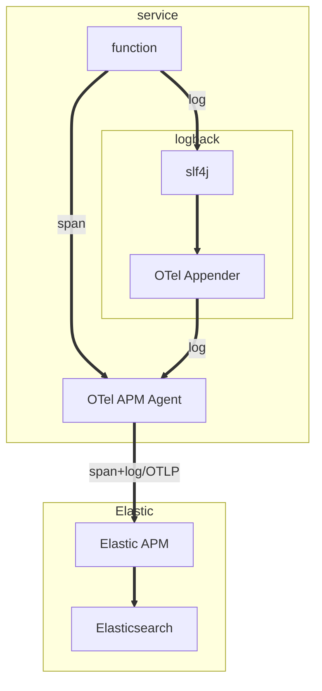
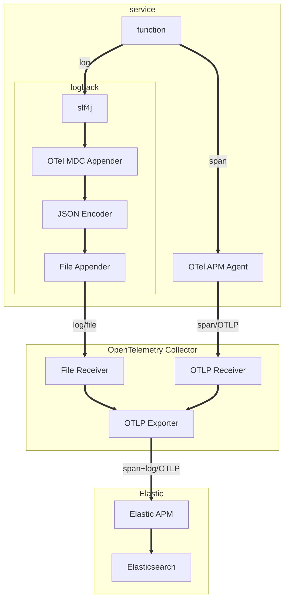
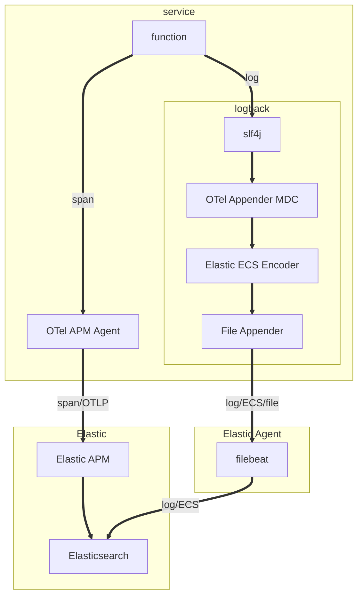

# OpenTelemetry Logging: State of the Art

Logging is the least mature of OpenTelemetry signals. Depending on your service's language, and your appetite for adventure, there exist several options for exporting logs from your services and marrying them together in your Observability backend with OTel-generated traces.

The intent of this article is to discuss and demonstrate those options and their pros and cons, with a specific focus on exporting span and log data to an Elastic Observability backend.

3 models currently exist for getting your service logs to Elastic with correlation to OTel tracing:
1. Funnel logs from your service to Elastic via the OTel APM Agent via the OTLP protocol
2. Write logs from your service to a file scrapped by the OTel Collector which then forwards to Elastic via the OTLP protocol
3. Write logs from your service to a file scrapped by Elastic Agent (or filebeat) which then forwards to Elastic via an Elastic protocol

Note that (1), in contrast to (2) and (3), does not involve writing serivce logs to a file prior to ingestion to Elastic.

## Getting Started

The demos center around a "POJO" (no assumed framework) Java project. Java is arguably the most mature of OTel-supported languages, particularly with respect to logging options. Notably, this singular Java project was designed to support the 3 models of logging discussed here. In practice, you would obviously only implement 1 of these models (and corresponding project dependencies).

The demos assume you have a working docker environment and an Elastic Cloud instance.

1. `git clone https://github.com/ty-elastic/otel-logging`
2. create an `.env` file at the root of `otel-logging` with the following (filled-in) environment variables:
```
# the service name
OTEL_SERVICE_NAME=app4

# filebeat vars
ELASTIC_CLOUD_ID=(see https://www.elastic.co/guide/en/beats/metricbeat/8.7/configure-cloud-id.html)
ELASTIC_CLOUD_AUTH=(see https://www.elastic.co/guide/en/beats/metricbeat/8.7/configure-cloud-id.html)

# apm vars
ELASTIC_APM_SERVER_ENDPOINT=(address of your Elastic Cloud APM server... i.e., https://xyz123.apm.us-central1.gcp.cloud.es.io:443)
ELASTIC_APM_SERVER_SECRET=(see https://www.elastic.co/guide/en/apm/guide/current/secret-token.html)
```
3. * if you want to demo logging via OTel APM Agent, run `MODE=apm docker-compose up`
   * if you want to demo logging via OTel filelogreceiver, run `MODE=filelogreceiver docker-compose up`
   * if you want to demo logging via Elastic filebeat, run `MODE=filebeat docker-compose up`
4. validate incoming span and correlated log data into your Elastic Cloud instance

## OTel APM Agent

This model aligns with the long-term goals of OTel: integrated tracing, metrics, and logging from your services via the OTel APM library, without dependency on external files and scrappers.

In this model, your service generates log statements as it always has, using popular logging libraries (e.g., logback for Java). OTel provides a "southbound hook" to logback, exposing SpanID and TraceID to log statements (if applicable), and exporting the log statements to the OTel APM Agent. From there, the OTel APM Agent formats the log statements per the OTel logging spec, and ships them via OTLP to either an OTel Collector for further routing and enrichment or directly to your Observability backend (e.g., Elastic).

One distinguishing advantage of this model, beyond the simplicity it affords, is the ability to more easily tie together attributes and tracing metadata directly with log statements. This inherently makes logging more useful in the context of other Observability signals.

### Architecture



### Pros
* simplified signal architecture (with no file-based logging)
* aligns with long-term OTel vision
* log statements can be decorated with integrated resource attributes
* no additional collectors/agents required

### Cons
* not available (yet) in all OTel-supported languages
* more challenging to debug unless you also write to a log file
* immature (alpha/experimental)
* unknown "glare" conditions which could result in loss of log data if service exits prematurely

### How To

Assuming you are using Java and logback, in addition to other required OTel and logback dependencies (see pom.xml), you will need to add


```
    <dependency>
      <groupId>io.opentelemetry</groupId>
      <artifactId>opentelemetry-exporter-otlp-logs</artifactId>
    </dependency>
    <dependency>
      <groupId>io.opentelemetry.instrumentation</groupId>
      <artifactId>opentelemetry-logback-appender-1.0</artifactId>
      <version>1.25.1-alpha</version>
    </dependency>
```
to your `pom.xml` file. From within your app, you will need to create

```
SdkLoggerProvider sdkLoggerProvider = SdkLoggerProvider.builder()
                .setResource(resource)
                .addLogRecordProcessor(
                    BatchLogRecordProcessor.builder(
                        OtlpGrpcLogRecordExporter.builder()
                            .setEndpoint(System.getenv("OTEL_EXPORTER_OTLP_ENDPOINT"))
                            .build()
                    ).build()
                ).build();

                OpenTelemetrySdk sdk = OpenTelemetrySdk.builder()
                                .setTracerProvider(sdkTracerProvider)
                                .setLoggerProvider(sdkLoggerProvider)
                                .build();
                GlobalOpenTelemetry.set(sdk);
                GlobalLoggerProvider.set(sdk.getSdkLoggerProvider());

                // Add hook to close SDK, which flushes logs
                Runtime.getRuntime().addShutdownHook(new Thread(sdk::close));
```

## OTel Collector FileReceiver

This model bridges between "legacy" services which cannot be instrumented with OTel logging and the OTel logging standard. Some services may not be readily instrumented with OTel logging either because it is not possible to bind the OTel APM Agent to the service, or because OTel logging is not yet available for the target language.

In this model, your service generates log statements as it always has, using popular logging libraries (e.g., logback for Java). OTel provides an "southbound hook" to logback, exposing SpanID and TraceID to log statements (if applicable). From there, we use logback to JSON encode the log line and write it to a file (or stdout, if using a container workflow).

We then configure the OTel Collector

the OTel APM Agent formats the log statements per the OTel logging spec, and ships them via OTLP to either an OTel Collector for further routing and enrichment or directly to your Observability backend (e.g., Elastic).



### Pros
* simplified signal architecture
* no additional collectors/agents required

### Cons
* not available (yet) in all OTel-supported languages
* immature (alpha/experimental)
* unknown "glare" conditions which could result in loss of log data if service exits prematurely


## Agent/Filebeat




## Logs vs. Span Events

