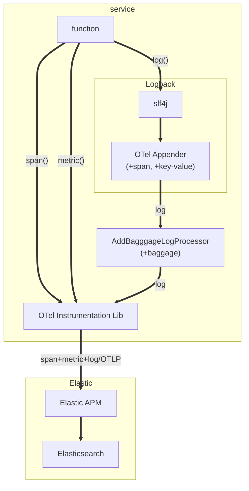
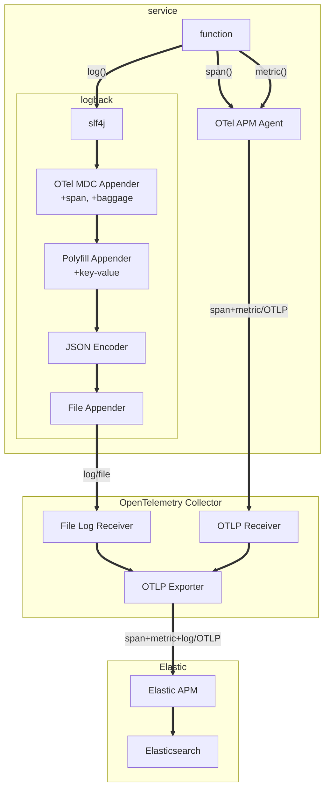
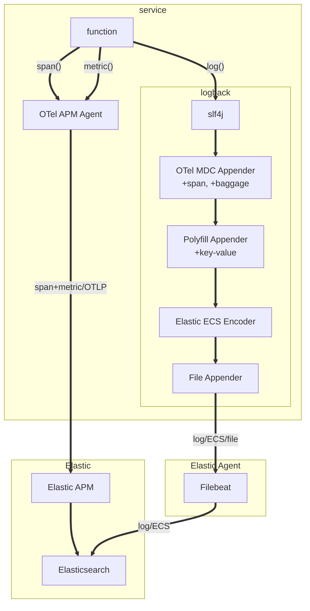

# Logging with OpenTelemetry + Elastic

Arguably, OpenTelemetry exists to (greatly) increase usage of tracing and metrics amongst developers. That said, logging will continue to play a critical role in providing flexible, application-specific, event-driven data. Further, OpenTelemetry has the potential to bring added value to existing application logging flows:
1) Common metadata across tracing, metrics, and logging to facilitate contextual correlation, including metadata passed between services as part of REST or RPC APIs; this is a critical element of service observability in the age of distributed, horizontally-scaled systems
2) An optional unified data path for tracing, metrics, and logging to facilitate common tooling and signal routing to your observability backend

Adoption of metrics and tracing amongst developers to date has been relatively small. Further, the number of proprietary vendors and APIs (compared to adoption rate) is relatively large. As such, OpenTelemetry took a greenfield approach to developing new, vendor-agnostic APIs for tracing and metrics. In contrast, most developers have nearly 100% log coverage across their services. Moreover, logging is largely supported by a small number of vendor-agnostic, open-source logging libraries and associated APIs (e.g., [Logback](https://logback.qos.ch) and [ILogger](https://learn.microsoft.com/en-us/dotnet/api/microsoft.extensions.logging.ilogger)). As such, [OpenTelemetry's approach to logging](https://opentelemetry.io/docs/specs/otel/logs/#introduction) meets developers where they already are using hooks into existing, popular logging frameworks. In this way, developers can add OpenTelemetry as a log signal output without otherwise altering their code and investment in logging as an observability signal.

Notably, logging is the least mature of OTel supported observability signals. Depending on your service's [language](https://opentelemetry.io/docs/instrumentation/#status-and-releases), and your appetite for adventure, there exist several options for exporting logs from your services and applications and marrying them together in your observability backend (ideally, Elastic, of course ;-)).

The intent of this article is to explore the current state of the art of OpenTelemetry logging and to provide guidance on the available approaches with the following tenants in mind:
* correlation of service logs with OTel-generated tracing where applicable
* proper capture of exceptions
* common context across tracing, metrics, and logging
* support for [slf4j key-value pairs](https://www.slf4j.org/manual.html#fluent) ("structured logging")
* automatic attachment of metadata carried between services via [OTel baggage](https://opentelemetry.io/docs/concepts/signals/baggage/)
* use of an Elastic observability backend
* consistent data fidelity in Elastic regardless of the approach taken

## OpenTelemetry Logging Models

Three models currently exist for getting your application or service logs to Elastic with correlation to OTel tracing and baggage:
1. Output logs from your service (alongside traces and metrics) using an embedded [OpenTelemetry Instrumentation library](https://opentelemetry.io/docs/instrumentation/#status-and-releases) to Elastic via the OTLP protocol
2. Write logs from your service to a file scrapped by the [OpenTelemetry Collector](https://opentelemetry.io/docs/collector/) which then forwards to Elastic via the OTLP protocol
3. Write logs from your service to a file scrapped by [Elastic Agent](https://www.elastic.co/elastic-agent) (or [Filebeat](https://www.elastic.co/beats/filebeat)) which then forwards to Elastic via an Elastic-defined protocol

Note that (1), in contrast to (2) and (3), does not involve writing service logs to a file prior to ingestion into Elastic.

## Logging vs. Span Events

It is worth noting that most APM systems, including OpenTelemetry, include provisions for [Span Events](https://opentelemetry.io/docs/instrumentation/ruby/manual/#add-span-events). Like log statements, Span Events contain arbitrary, textual data. Additionally, Span Events automatically carry any custom attributes (e.g., a "user ID") applied to the parent Span which can help with correlation and context. In this regard, it may be advantageous to translate some existing log statements (inside spans) to Span Events. As the name implies, of course, Span Events can only be emitted from within a span, and thus are not intended to be a general purpose replacement for logging.

Unlike logging, Span Events do not pass through existing logging frameworks, and thus cannot (practically) be written to a log file. Further, Span Events are technically emitted as part of trace data, and follow the same data path and signal routing as other trace data.

## Polyfill Appender

Some of the demos make use of a custom Logback ["Polyfill Appender"](./java-otel-log/src/main/java/com/tb93/otel/batteries/OtelPolyfillAppender.java) (inspired by OTel's [Logback MDC](https://github.com/open-telemetry/opentelemetry-java-instrumentation/tree/main/instrumentation/logback/logback-mdc-1.0/library)) which provides support for attaching [slf4j key-value pairs](https://www.slf4j.org/manual.html#fluent) to log messages using models (2) and (3).

## Elastic Common Schema

For log messages to exhibit full fidelity within Elastic, they eventually need to be formatted in accordance with the [Elastic Common Schema](https://www.elastic.co/guide/en/ecs/current/ecs-reference.html) (ECS). In Models (1) and (2), log messages remain formatted in OTel log semantics until ingested by the Elastic APM Server. The Elastic APM Server then translates OTel log semantics to ECS. In model (3), ECS is applied at the source.

Notably, OpenTelemetry recently [adopted ECS](https://opentelemetry.io/blog/2023/ecs-otel-semconv-convergence/) as their standard for semantic conventions going forward. As such, it is anticipated that current OTel log sematics will be updated to align with ECS.

## Getting Started

The included demos center around a "POJO" (no assumed framework) Java project. Java is arguably the most mature of OTel-supported languages, particularly with respect to logging options. Notably, this singular Java project was designed to support the three models of logging discussed here. In practice, you would obviously only implement one of these models (and corresponding project dependencies).

The demos assume you have a working [docker](https://www.docker.com/) environment and an [Elastic Cloud](https://www.elastic.co/cloud/) instance.

1. `git clone https://github.com/ty-elastic/otel-logging`
2. create an `.env` file at the root of `otel-logging` with the following (appropriately filled-in) environment variables:
```
# the service name
OTEL_SERVICE_NAME=app4

# Filebeat vars
ELASTIC_CLOUD_ID=(see https://www.elastic.co/guide/en/beats/metricbeat/8.7/configure-cloud-id.html)
ELASTIC_CLOUD_AUTH=(see https://www.elastic.co/guide/en/beats/metricbeat/8.7/configure-cloud-id.html)

# apm vars
ELASTIC_APM_SERVER_ENDPOINT=(address of your Elastic Cloud APM server... i.e., https://xyz123.apm.us-central1.gcp.cloud.es.io:443)
ELASTIC_APM_SERVER_SECRET=(see https://www.elastic.co/guide/en/apm/guide/current/secret-token.html)
```
3. * if you want to demo logging via OTel APM Agent, run `MODE=apm docker-compose up`
   * if you want to demo logging via OTel filelogreceiver, run `MODE=filelogreceiver docker-compose up`
   * if you want to demo logging via Elastic filebeat, run `MODE=filebeat docker-compose up`
4. validate incoming span and correlated log data in your Elastic Cloud instance

## Model 1: Logging via OpenTelemetry Instrumentation

This model aligns with the long-term goals of OpenTelemetry: [integrated tracing, metrics, and logging (with common attributes) from your services](https://opentelemetry.io/docs/specs/otel/logs/#opentelemetry-solution) via the [OpenTelemetry Instrumentation libraries](https://opentelemetry.io/docs/instrumentation/#status-and-releases), without dependency on log files and scrappers.

In this model, your service generates log statements as it always has, using popular logging libraries (e.g., [Logback](https://logback.qos.ch) for Java). OTel provides a "southbound hook" to Logback (the OTel [Logback Appender](https://github.com/open-telemetry/opentelemetry-java-instrumentation/tree/main/instrumentation/logback/logback-appender-1.0/library)), injecting ServiceName, SpanID, TraceID, slf4j key-value pairs, and OTel baggage into log records and passing the composed records to the co-resident OpenTelemetry Instrumentation Library. From there, we employ a [custom LogRecordProcessor](./java-otel-log/src/main/java/com/tb93/otel/batteries/AddBaggageLogProcessor.java) to add baggage to the log record as attributes.

The OTel instrumentation library then formats the log statements per the [OTel logging spec](https://opentelemetry.io/docs/specs/otel/logs/data-model/), and ships them via OTLP to either an OTel Collector for further routing and enrichment or directly to Elastic.

Notably, as language support improves, this model can and will be supported by runtime agent binding with auto-instrumentation where available (e.g., no code changes required for runtime languages).

One distinguishing advantage of this model, beyond the simplicity it affords, is the ability to more easily tie together attributes and tracing metadata directly with log statements. This inherently makes logging more useful in the context of other OTel-supported observability signals.

### Architecture



Although not explicitly pictured, an [OpenTelemetry Collector](https://opentelemetry.io/docs/collector/) can be inserted in-between the service and Elastic to facilitate additional enrichment and/or signal routing or duplication across observability backends.

### Pros
* simplified signal architecture and fewer "moving parts" (no files, disk utilization, or file rotation concerns)
* aligns with long-term OTel vision
* log statements can be (easily) decorated with OTel metadata
* no polyfill adapter required to support structured logging with slf4j
* no additional collectors/agents required
* conversion to ECS happens within Elastic keeping log data vendor-agnostic until ingestion
* with optional Collector, logs can be routed to multiple observability backends

### Cons
* not available (yet) in most OTel-supported languages
* no intermediate log file for ad-hoc, on-node debugging
* immature (alpha/experimental)
* unknown "glare" conditions which could result in loss of log data if service exits prematurely or if the backend is unable to accept log data for an extended period of time

Ultimately, while architecturally clean, the cons (most notably lack of mature implementations and possible data loss coditions) make this model a less than ideal choice (today) for most production workloads.

### Demo

`MODE=apm docker-compose up`

## Model 2: Logging via the OpenTelemetry Collector

Given the cons of Model 1, it may be advantageous to consider a model which continues to leverage an actual log file intermediary between your services and your observability backend. Such a model is possible using an [OpenTelemetry Collector](https://opentelemetry.io/docs/collector/) collocated with your services (e.g., on the same host) and running the [filelogreceiver](https://github.com/open-telemetry/opentelemetry-collector-contrib/blob/main/receiver/filelogreceiver/README.md) to scrape their log file output.

In this model, your service generates log statements as it always has, using popular logging libraries (e.g., [Logback](https://logback.qos.ch) for Java). Notably, OTel provides a MDC Appender for Logback ([Logback MDC](https://github.com/open-telemetry/opentelemetry-java-instrumentation/tree/main/instrumentation/logback/logback-mdc-1.0/library)), which adds SpanID, TraceID, and Baggage to the [Logback MDC context](https://logback.qos.ch/manual/mdc.html).

Notably, no log record structure is assumed by the OTel filelogreceiver. In the example provided, we employ the [logstash-logback-encoder](https://github.com/logfellow/logstash-logback-encoder) to JSON-encode log messages to simplify parsing in the filelogreceiver. Notably, logstash-logback-encoder doesn't explicitly support [slf4j key-value arguments](https://www.slf4j.org/manual.html#fluent). It does, however, support [Logback structured arguments](https://github.com/logfellow/logstash-logback-encoder#event-specific-custom-fields), and thus I use the [Polyfill Appender](./java-otel-log/src/main/java/com/tb93/otel/batteries/PolyfillAppender.java) to convert slf4j key-value arguments to Logback structured arguments.

From there, we write the log lines to a log file. If you are using Kubernetes or other container orchestration in your environment, you would more typically write to stdout (console) and let the orchestration log driver write to and manage log files.

We then [configure](collector/filelogreceiver.yml) the OTel Collector to scrape this log file (using the filelogreceiver). Because no assumptions are made about the format of the log lines, you need to [explicitly map fields](https://github.com/open-telemetry/opentelemetry-collector-contrib/blob/main/pkg/stanza/docs/types/parsers.md#parsers) from your log schema to the OTel log schema.

From there, the OTel Collector batches and ships the formatted log lines via OTLP to Elastic.



### Pros
* easy to debug (you can manually read the intermediate log file)
* inherent file-based FIFO buffer
* less susceptible to "glare" conditions when service prematurely exits
* conversion to ECS happens within Elastic keeping log data vendor-agnostic until ingestion
* with optional OTel Collector, logs can be routed to multiple observability backends

### Cons
* all the headaches of file-based logging (rotation, disk overflow)
* not widely proven in the field

### Demo

`MODE=filelogreceiver docker-compose up`

## Model 3: Logging via Elastic Agent (or Filebeat)

Although the second model described affords some resilience as a function of the backing file, the OTel Collector filelogreceiver module is still decidedly ["beta"](https://github.com/open-telemetry/opentelemetry-collector-contrib/tree/main/receiver/filelogreceiver) in quality. Because of the importance of logs as a debugging tool, today I generally recommend that customers continue to import logs into Elastic using the field-proven [Elastic Agent](https://www.elastic.co/elastic-agent) or [Filebeat](https://www.elastic.co/beats/filebeat) scrappers. Elastic Agent and Filebeat have many years of field maturity under their collective belt. Further, it is often advantageous to deploy Elastic Agent anyway to capture the multitude of signals outside the purview of OpenTelemetry (e.g., deep Kubernetes and host metrics, security, etc.).

In this model, your service generates log statements as it always has, using popular logging libraries (e.g., [Logback](https://logback.qos.ch) for Java). As with model 2, we employ OTel's [Logback MDC](https://github.com/open-telemetry/opentelemetry-java-instrumentation/tree/main/instrumentation/logback/logback-mdc-1.0/library) to add SpanID, TraceID, and Baggage to the [Logback MDC context](https://logback.qos.ch/manual/mdc.html).

From there, we employ the [Elastic ECS Encoder](https://www.elastic.co/guide/en/ecs-logging/java/current/setup.html) to encode log statements complaint to the Elastic Common Schema. Similar to model 2, I found that the [Elastic ECS Encoder](https://www.elastic.co/guide/en/ecs-logging/java/current/setup.html) doesn't support sl4f key-vair arguments. Curiously, the Elastic ECS encoder also doesn't appear to support Logback structured arguments. Thus, within the Polyfill Appender, I add slf4j key-value arguments as MDC context (which is supported by the Elastic ECS Encoder). This is less than ideal, however, since MDC values are always strings while slf4j key-value arguments need not be strings.

From there, we write the log lines to a log file. If you are using Kubernetes or other container orchestration in your environment, you would more typically write to stdout (console) and let the orchestration log driver write to and manage log files. 

We then configure Elastic Agent or Filebeat to scrape the log file. Notably, the Elastic ECS Encoder does not currently translate incoming OTel SpanID and TraceID variables on the MDC. Thus, we need to perform manual translation of these variables in the [Filebeat (or Elastic Agent) configuration](./filebeat.yml) to map them to their ECS equivalent.

### Architecture



### Pros
* robust and field-proven
* easy to debug (you can manually read the intermediate log file)
* inherent file-based FIFO buffer
* less susceptible to "glare" conditions when service prematurely exits
* native ECS format for easy manipulation in Elastic

### Cons
* all the headaches of file-based logging (rotation, disk overflow)
* poor support for slf4j key-value pairs
* requires translation of OTel SpanID and TraceID in filebeat config

### Demo

`MODE=filebeat docker-compose up`

## Recommendations

For most customers, I currently recommend Model 3: namely, write to logs in ECS format (with OTel SpanID and TraceID metadata), and collect with an Elastic Agent installed on the node hosting the application or service. Ideally, you have one instance of Elastic Agent running at the OS or [daemonset (k8s)](https://www.elastic.co/guide/en/fleet/current/running-on-kubernetes-managed-by-fleet.html) level. Today, this provides the most field-proven and robust means of capturing log files from applications and services with OpenTelemetry context. Further, you can utilize this same Elastic Agent instance to collect rich and robust [Kubernetes metrics](https://docs.elastic.co/en/integrations/kubernetes), host metrics, along with many other third-party services through Elastic [Integrations](https://www.elastic.co/integrations/data-integrations). Finally, Elastic Agent permits remote command and control management via [Fleet](https://www.elastic.co/guide/en/fleet/current/fleet-overview.html), avoiding bespoke configuration files. 

Alternatively, for customers who either wish to keep their nodes vendor-neutral (e.g., no vendor agents) or use a consolidated signal routing system (e.g., a desire to send logs to multiple systems via one agent), I recommend Model 2, wherein an OpenTelemetry collector is used to scrape service log files. While workable and practiced in the field today, this model inherently carries some risk given the current beta nature of the OpenTelemetry filelogreceiver.

I generally do not recommend Model 1 given its limited language support, experimental/alpha status (the API chould change), and current potential for data loss. That said, in time, with more language support, and more thought to resilient designs, it has obviously advantages both with regard to simplicity and richness of metadata.

## TODO

I intend to create PRs to address the following trivial, but cumbersome, shortcomings uncovered as part of this exploration:

- [ ] PR to support translating OTel TraceID and SpanID to Elastic ECS Encoder
- [ ] PR to support slf4j key-value pairs in Elastic ECS Encoder
- [ ] PR to support slf4j key-value pairs in logstash-logback-encoder

With time, I'd also like to look into the practical state of affairs for other popular OTel-supported languages (e.g., .NET, JavaScript, and golang).